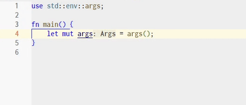
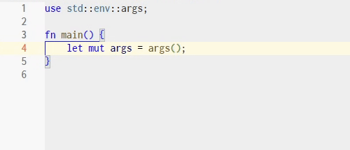

Bring VSCode's format-on-type feature to all languages, even if some do not natively support it.

VSCode gives various powers to language formatters. Which features to implement is up to the designers. One of such powers is range formatting, which triggers a formatting for the `Format Selection` command. Another is format-on-type, which triggers a formatting whenever user types certain characters. For language formatters that only implement the former and lack the latter, this extension aims to fill the gap.

This extension adds 3 types of on-type formatting: closing curly bracket / brace ('}'), newline ('\\n') and semicolon (';') :

* For closing brace, find the matching opening brace and format the block in-between. Equivalent to the "Automatically format block when I type a }" feature in Visual Studio.
* For newline and semicolon, format the current line. Equivalent to the "Automatically format statement when I type a ;" feature in Visual Studio.

This extension comes with settings to customize on which languages will each of the formatting be enabled. By default all suitable languages are enabled.

Note that if a language formatter has already implemented the on-type formatting feature, VSCode may prioritize the language formatter thus ignore this extension.

### Requirement

* The setting `editor.formatOnType` must be `true`.
* A language formatter supporting range formatting.

### Demo: Editing a "Hello World" in [Rust](https://www.rust-lang.org/)

Without the extension:

With the extension:

